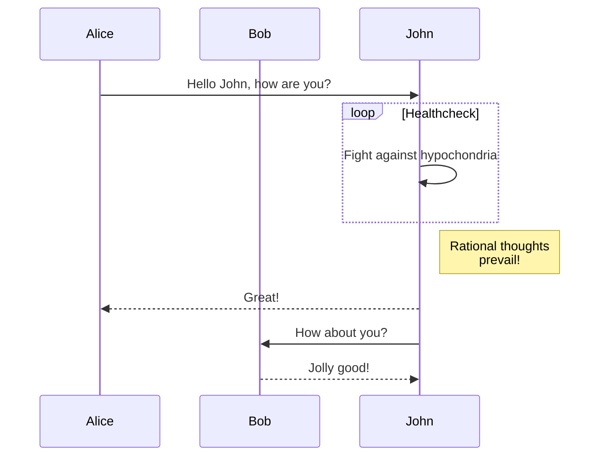

# @aomao/plugin-mermaid

mermaid plugin (support markdown syntax to generate mermaid charts)

## Install

```bash
yarn add @aomao/plugin-mermaid
```

add to engine

```ts
import Engine, { EngineInterface } from '@aomao/engine';
import Mermaid , { MermaidComponent } from '@aomao/plugin-mermaid';

new Engine(...,{ plugins:[Mermaid] , cards:[MermaidComponent]})
```

## Grammar

```mermaid
 mermaid syntax (currently supports flowchart, sequence diagram, pie chart, Gantt chart, gitGraph, erDiagram, journey, stateDiagram)
```

ps:
Syntax reference:
1、<https://mermaid-js.github.io/mermaid-live-editor/edit#pako:eNptjzsOwjAQRK-ybEtyARdBSBSEljbNypmQSP6AYwtFiLtjB-jSjWbfW2lerH0PVtw5ohmPBKdxmuQWxJaK6Ggmjbpp9hc_OkVnGOOp5IpG_yQJoMWnwyb8xbS4gtAICWTxQ8utzmi9Ovnx9LUraldjpbO228ZbGgBDtwCJO67YIliZ-rzkVYSO4wiLjlWOPQZJJnZ55DujkqK_Lk6ziiGh4nTvJf5HsxrEzHh_AOMAWgk>

2、<https://mermaid-js.github.io/mermaid/#/n00b-syntaxReference>



## Command

```ts
// can carry parameters, the second mermaid syntax
engine.command.execute(
	'mermaid',
	`sequenceDiagram
  participant Alice
  participant Bob
  Alice->>John: Hello John, how are you?
  loop Healthcheck
   John->>John: Fight against hypochondria
  end
  Note right of John: Rational thoughts <br/>prevail!
  John-->>Alice: Great!
  John->>Bob: How about you?
  Bob-->>John: Jolly good!`,
);
```
