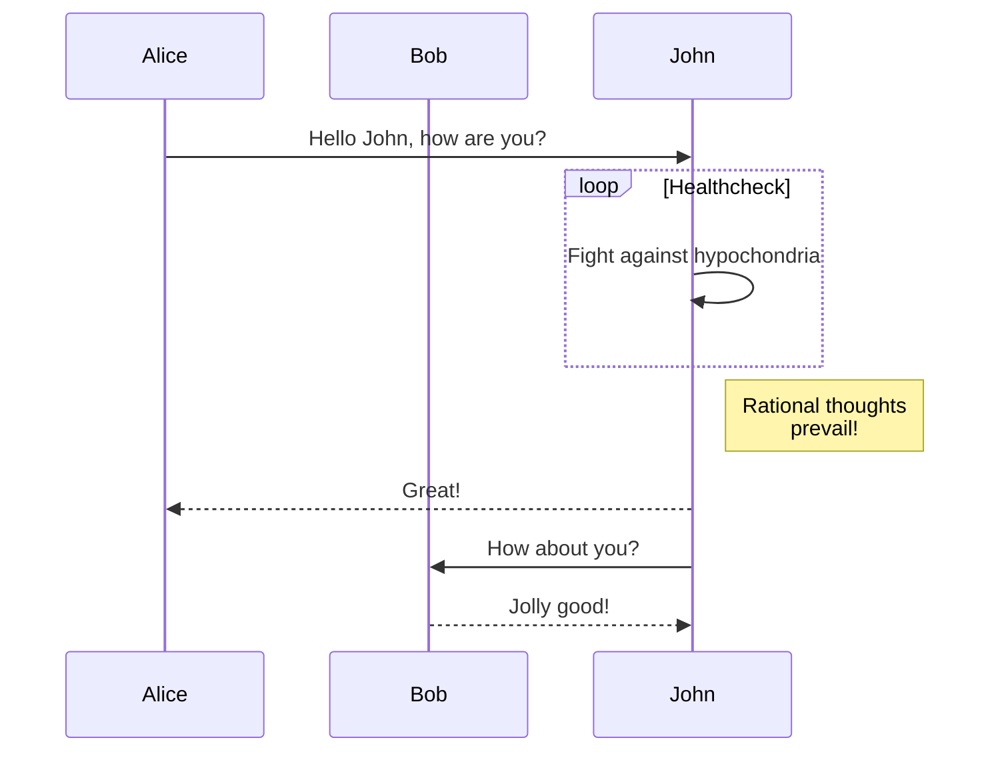

# @aomao/plugin-mermaid

mermaid 插件 (支持 markdown 语法生成 mermaid 图表)

## 安装

```bash
yarn add @aomao/plugin-mermaid
```

添加到引擎

```ts
import Engine, { EngineInterface } from '@aomao/engine';
import Mermaid , { MermaidComponent } from '@aomao/plugin-mermaid';

new Engine(...,{ plugins:[Mermaid] , cards:[MermaidComponent]})
```

## 语法

```mermaid
 mermaid 语法（目前支持流程图、时序图、饼图、甘特图、gitGraph、erDiagram、journey、stateDiagram）
```

ps:
语法参考：
1、<https://mermaid-js.github.io/mermaid-live-editor/edit#pako:eNptjzsOwjAQRK-ybEtyARdBSBSEljbNypmQSP6AYwtFiLtjB-jSjWbfW2lerH0PVtw5ohmPBKdxmuQWxJaK6Ggmjbpp9hc_OkVnGOOp5IpG_yQJoMWnwyb8xbS4gtAICWTxQ8utzmi9Ovnx9LUraldjpbO228ZbGgBDtwCJO67YIliZ-rzkVYSO4wiLjlWOPQZJJnZ55DujkqK_Lk6ziiGh4nTvJf5HsxrEzHh_AOMAWgk>

2、<https://mermaid-js.github.io/mermaid/#/n00b-syntaxReference>



## 命令

```ts
// 可携带参数，第二个mermaid语法
engine.command.execute(
	'mermaid',
	`sequenceDiagram
  participant Alice
  participant Bob
  Alice->>John: Hello John, how are you?
  loop Healthcheck
   John->>John: Fight against hypochondria
  end
  Note right of John: Rational thoughts <br/>prevail!
  John-->>Alice: Great!
  John->>Bob: How about you?
  Bob-->>John: Jolly good!`,
);
```
